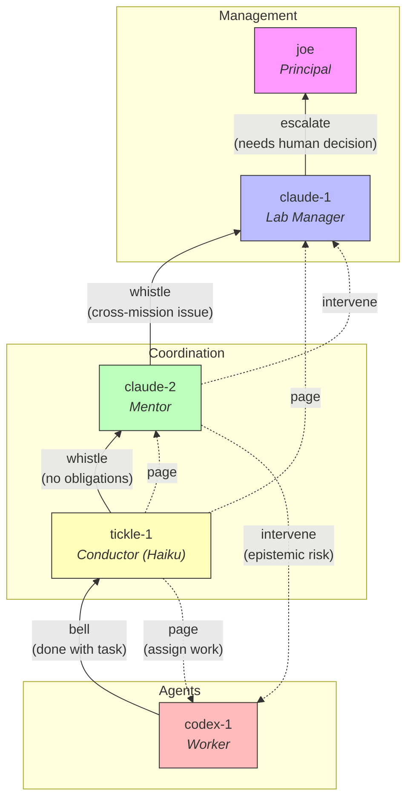

# Fulab Coordination Patterns

Patterns governing how agents coordinate in the futon lab (fulab). Covers
conductor cycles, escalation hierarchy, anti-noise guards, and shared
inspectability. Emerged from war-bulletin-5 noise analysis and subsequent
refinement.

## Roles and Hierarchy

| Agent     | Role         | Responsibility                                         |
|-----------|--------------|--------------------------------------------------------|
| claude-1  | Lab Manager  | Lab infra, wiring, coordination design, pairing w/ joe |
| claude-2  | Mentor       | Proof ledger owner, epistemic risk watcher (per-mission)|
| tickle-1  | Conductor    | Round-robin work assignment, follow-up (Haiku)         |
| codex-1   | Worker       | Scoped task execution                                  |

### Escalation hierarchy

```
joe (Principal)
  claude-1 (Lab Manager) — lab infra, cross-mission, pairing surface
    claude-2 (Mentor) — epistemic oversight, proof ledger (per-mission)
    tickle-1 (Conductor) — mechanical round-robin (per-mission)
    codex-1 (Worker) — scoped task execution
```

The Lab Manager owns the coordination infrastructure that all missions
and agents run on. The Mentor owns the epistemic domain for a specific
mission. The Conductor owns the mechanical paging loop. Workers execute
scoped tasks.

Escalation flows upward: Workers bell Tickle, Tickle whistles Mentor,
Mentor whistles Lab Manager, Lab Manager talks to joe.

### Escalation diagram



Solid arrows (↑) = escalation (bell/whistle upward).
Dotted arrows (↓) = direction (page/intervene downward).

## Pattern 1: Round-Robin Conductor

The FM conductor cycles through a rotation of agents (default: claude-1,
codex-1, claude-2) on a fixed step interval (default: 300s). Each cycle:

1. Select next agent from rotation
2. Check mechanical cooldown (skip if paged recently)
3. Build context: assignable obligations + recent IRC
4. Invoke tickle-1 (Haiku) to decide: PAGE or PASS
5. If PAGE: post to #math, record cooldown
6. If PASS: check whistle condition (see Pattern 3)
7. Advance rotation index

**File**: `src/futon3c/agents/tickle_orchestrate.clj` — `fm-conduct-cycle!`

## Pattern 2: Two-Layer Anti-Noise Guard

*Source: war-bulletin-5 finding — 40% noise from stateless orchestrator*

Problem: Stateless conductor re-paged the same agent 5 times in 16 minutes.

Solution: Two independent layers that compound noise reduction:

### Layer 1: Mechanical Cooldown (hard gate)
- Per-agent timestamp in conductor state atom
- Default 15-minute cooldown per agent
- Checked *before* invoking Haiku — saves LLM calls entirely
- Tracked as `{:last-paged {"agent-id" epoch-ms}}` in conductor state
- Cooldown key `"whistle:<mentor>"` tracks whistle cooldown separately

### Layer 2: Prompt Rule 7 (soft gate)
- Haiku sees recent #math messages in context
- Rule 7: "If YOU (tickle) already said something similar in RECENT #math — PASS"
- Catches semantic duplicates the mechanical timer misses
- Works even if cooldown expired but the previous message is still relevant

**Why two layers**: Layer 1 is cheap (no LLM call). Layer 2 catches what
timers can't (semantic similarity). Neither alone is sufficient.

## Pattern 3: Bell and Whistle Escalation

Agents escalate completion signals upward through the coordination hierarchy:

```
Agent (prover) --bell--> Tickle (conductor) --whistle--> Mentor (claude-2)
```

### Bell (agent -> Tickle)
When an agent completes work, it "bells" Tickle — signals that it's done
and available for new assignment. This can be explicit (posting "done" on
IRC) or implicit (Tickle notices the agent is idle during a cycle).

### Whistle (Tickle -> Mentor)
When Tickle PASSes on an agent AND there are zero assignable obligations,
the problem isn't "agent is busy" — it's "the ledger is empty." Tickle
whistles the Mentor to trigger a ledger review.

Conditions for whistle:
- Tickle PASS (not MESSAGE, not COOLDOWN)
- `assignable` count is 0 (no open, unblocked obligations)
- Target agent is not the Mentor (no circular whistle)
- Whistle cooldown not active (same 15-min window as page cooldown)

Message format: `@claude-2 [whistle] No assignable obligations for <agent> — ledger review needed?`

**Why this matters**: Without the whistle, an empty ledger means all agents
idle and nobody notices. The Mentor owns the ledger; only the Mentor can
create new obligations or unblock existing ones.

**File**: `src/futon3c/agents/tickle_orchestrate.clj` — whistle block in `fm-conduct-cycle!`

## Pattern 4: Blackboard Inspectability

The conductor state is projected to a `*tickle*` Emacs buffer via the
blackboard system. Shows:

- Problem ID, cycle count, step interval
- **Next cycle wall-clock time** — removes ambiguity about past vs future
- Agent rotation with `▶` next-agent marker
- Per-agent cooldown status (remaining seconds or "ready")
- Last action: target, action type, message preview

Auto-updates after each conductor cycle via `on-cycle-fn` callback.

**Files**:
- `src/futon3c/blackboard.clj` — `format-tickle-conductor`, `render-blackboard :tickle`
- `dev/futon3c/dev.clj` — `project-tickle-state!`, CYDER `state-fn`

## Pattern 5: CYDER Process Registration

The FM conductor registers with the CYDER process registry for:
- **I-7 Stoppability**: `stop-fn` halts the conductor loop
- **I-8 Inspectability**: `state-fn` returns live conductor state
- **Step-fn**: Manual single-step (bypasses cooldown for deliberate action)

CYDER ID: `"fm-conductor"`

## Invariant: Shared Memory Is Agent-Neutral

The auto-memory file (`MEMORY.md`) is shared across all agents that work
in this codebase. It must be written in third person with a role table,
not as "I am X." Any agent should be able to read it and orient without
identity confusion.

Bad: "I am the Mentor. I own the proof ledger."
Good: "claude-2 is the Mentor. The Mentor owns the proof ledger."
