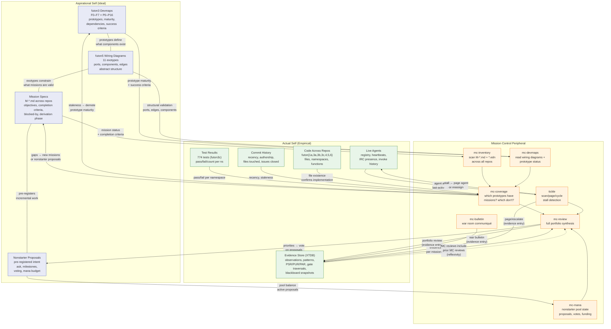

# Mission Control System Architecture

Two layers: what the stack **wants to be** (aspirational/ideal) and what it
**is** (empirical/actual). Mission Control sits between them, comparing and
feeding back. The reflexivity loop closes when MC's own output becomes part
of what it observes.

Reference: futon3 P11 — System Self-Description. "This closes the reflexivity
loop — a semantic network that includes a model of itself."

Psychological parallel: Higgins' self-discrepancy theory. Ideal self (devmaps)
vs actual self (evidence). The discrepancy generates corrective action.

See [War Bulletin 3](../../futon3/holes/war-bulletin-3.md) for the full
strategic assessment.

