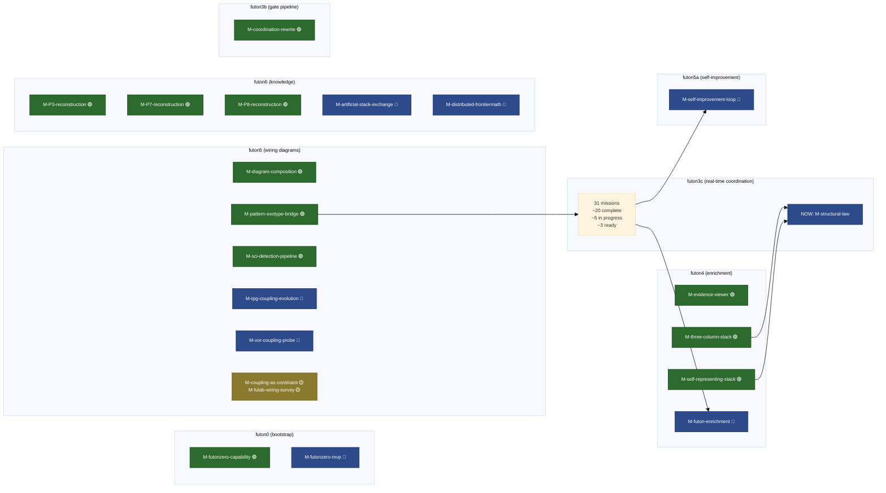

# Mission Landscape — 2026-03-15

84 missions across 10 repos. This document shows the dependency structure
and completion state as Mermaid diagrams.

**Legend**: 🟢 Complete | 🔵 In Progress | 🟡 Ready | ⚪ Not Started | 🔘 Superseded

## 1. The Core Pipeline

The main dependency chain through futon3c — from social exotype derivation
through to the current mission (M-structural-law).

```mermaid
%%{init: {'theme': 'base', 'themeVariables': {'fontSize': '12px'}}}%%
flowchart TD
    classDef done fill:#2d6a2d,stroke:#1a4a1a,color:#fff
    classDef inprog fill:#2d4a8a,stroke:#1a3070,color:#fff
    classDef ready fill:#8a7a2d,stroke:#706020,color:#fff
    classDef notstart fill:#555,stroke:#333,color:#ccc
    classDef superseded fill:#444,stroke:#333,color:#888,stroke-dasharray: 5 5

    %% Foundation layer (futon3 → futon3c migration)
    subgraph "Foundation (futon3 → 3c migration)"
        F3_agency["M-agency-rebuild 🔘"]:::superseded
        F3_forum["M-agency-forum 🔘"]:::superseded
        F3_drawbridge["M-drawbridge-multi-agent 🔘"]:::superseded
        F3_par["M-par-session-punctuation 🔘"]:::superseded
    end

    %% Social exotype derivation
    subgraph "Social Exotype Derivation"
        social["M-social-exotype 🟢"]:::done
        agency["M-agency-refactor 🟢"]:::done
        forum["M-forum-refactor 🟢"]:::done
        pmodel["M-peripheral-model 🟢"]:::done
    end

    social --> agency
    social --> forum
    social --> pmodel
    F3_agency -.->|superseded by| agency
    F3_forum -.->|superseded by| agency
    F3_drawbridge -.->|superseded by| agency
    F3_par -.->|superseded by| pbehavior

    %% Peripheral stack
    subgraph "Peripheral Stack"
        pbehavior["M-peripheral-behavior 🟢"]:::done
        bridge["M-dispatch-peripheral-bridge 🟢"]:::done
        phenom["M-peripheral-phenomenology 🟢"]:::done
        gauntlet["M-peripheral-gauntlet 🟢"]:::done
        transport["M-transport-adapters 🟢"]:::done
        irc["M-IRC-stability 🟢"]:::done
    end

    pmodel --> pbehavior
    pbehavior --> bridge
    pbehavior --> phenom
    phenom --> gauntlet
    bridge --> transport
    transport --> irc

    %% Evidence & mission control
    subgraph "Evidence & Mission Control"
        mission_p["M-mission-peripheral 🟢"]:::done
        mission_c["M-mission-control 🟢"]:::done
        portfolio["M-portfolio-inference 🟢"]:::done
    end

    forum --> mission_p
    mission_p --> mission_c
    mission_c --> portfolio

    %% Coordination & agent behavior
    subgraph "Coordination Layer"
        psr["M-psr-pur-mesh-peripheral 🟢"]:::done
        walkie["M-walkie-talkie 🟢"]:::done
        codex_b["M-codex-agent-behaviour 🟢"]:::done
        codex_e["M-codex-irc-execution 🟢"]:::done
        tickle["M-tickle-overnight 🟢"]:::done
        coord["M-coordination-rewrite 🟢"]:::done
    end

    %% Operational
    subgraph "Operational Readiness"
        opready["M-operational-readiness 🟢"]:::done
        alfworld["M-alfworld-pattern-discovery 🟢"]:::done
    end

    %% Current growth edge
    subgraph "Current Growth Edge"
        cyder["M-cyder 🔵"]:::inprog
        stepper["M-stepper-calibration 🔵"]:::inprog
        structural["M-structural-law 🔵"]:::inprog
        violations["M-invariant-violations 🔵"]:::inprog
        fulab_logic["M-fulab-logic ⚪"]:::notstart
    end

    portfolio --> cyder
    portfolio --> fulab_logic
    violations --> structural
    mission_c --> cyder

    %% Future
    subgraph "Ready / Waiting"
        auto_lifecycle["M-autonomous-pattern-lifecycle 🟡"]:::ready
        sliding["M-sliding-blackboard 🟡"]:::ready
        last_mile["M-futon3-last-mile 🟡"]:::ready
    end

    walkie --> auto_lifecycle
    psr --> auto_lifecycle
    gauntlet --> last_mile
    forum --> last_mile
```



## 2. Cross-Repo View

How the repos relate to each other at the mission level.



## 3. Completion Iceberg

The "3D printer" view — what's solidified vs what's being printed.

```
SOLIDIFIED (complete — the platform stands on these)
════════════════════════════════════════════════════
  futon3c: social-exotype, agency-refactor, forum-refactor,
           peripheral-model, peripheral-behavior, dispatch-bridge,
           phenomenology, gauntlet, transport-adapters, IRC-stability,
           mission-peripheral, mission-control, portfolio-inference,
           psr-pur-mesh, walkie-talkie, codex-behaviour, codex-execution,
           tickle-overnight, operational-readiness, alfworld-discovery
  futon3b: coordination-rewrite
  futon4:  evidence-viewer, self-representing-stack, three-column-stack
  futon5:  diagram-composition, pattern-exotype-bridge, sci-detection
  futon6:  P3/P7/P8 rational reconstructions
  futon0:  futonzero-capability

CURING (in progress — current print layer)
════════════════════════════════════════════
  futon3c: ██ M-structural-law (IDENTIFY — current focus)
           ██ M-cyder (in progress)
           ██ M-stepper-calibration (P1+P7 done, P3 next)
           ██ M-invariant-violations (MAP)
  futon4:  ██ M-futon-enrichment (INSTANTIATE)
  futon5:  ██ M-tpg-coupling-evolution (MAP)
           ██ M-xor-coupling-probe (DERIVE)
  futon5a: ██ M-self-improvement-loop (IDENTIFY+DERIVE)
  futon6:  ██ M-distributed-frontiermath
           ██ M-artificial-stack-exchange (IDENTIFY)
  futon0:  ██ M-futonzero-mvp (IDENTIFY)

POWDER BED (ready — next to solidify)
══════════════════════════════════════
  futon3c: ░░ M-autonomous-pattern-lifecycle (READY)
           ░░ M-fulab-logic (NOT STARTED)
           ░░ M-futon3-last-mile
           ░░ M-sliding-blackboard
  futon5:  ░░ M-coupling-as-constraint (Ready)
           ░░ M-fulab-wiring-survey (Ready)

DONE-NEEDS-RETRO (printed but not inspected)
═════════════════════════════════════════════
  futon3c: ◊ M-psr-pur-mesh-peripheral
           ◊ M-social-exotype

SUPERSEDED (futon3 originals — absorbed into futon3c)
═════════════════════════════════════════════════════
  ~8 missions: agency-rebuild, agency-forum, drawbridge-multi-agent,
  par-session-punctuation, labs-integration, make-agency-work-properly,
  understand-fucodex, agency-unified-routing

GRAY ZONE (~26 futon3 missions with no clear status)
═════════════════════════════════════════════════════
  Mostly pre-split futon3 missions that may be dead, superseded,
  or waiting for someone to look at them. Triage needed.
```

## Counts

| Layer | Count |
|-------|-------|
| Solidified | ~30 |
| Curing (in progress) | ~10 |
| Powder bed (ready) | ~6 |
| Done-needs-retro | 2 |
| Superseded | ~8 |
| Gray zone | ~26 |
| **Total** | **~84** |
