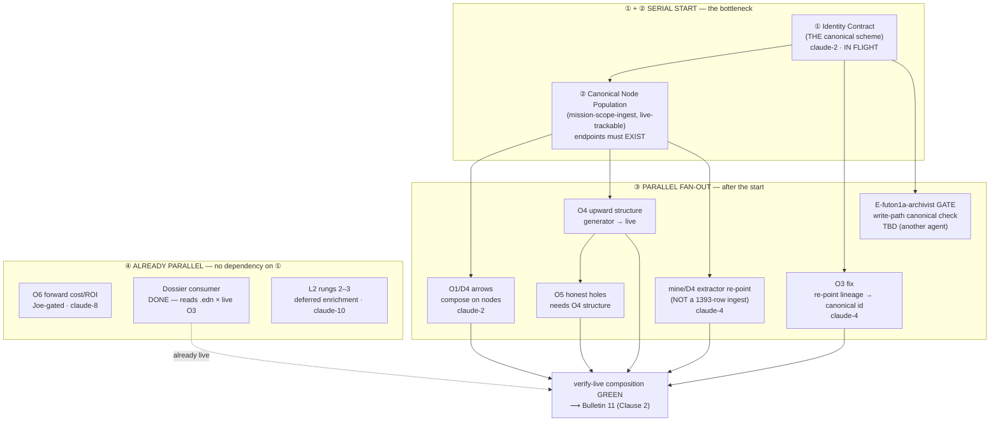

# C-cascade-real — RUN/DELIVER parallelism cascade (2026-06-30)

*Can RUN/DELIVER be parallelized, or is it linear? Answer: a **short serial start**
(2 steps), then a **wide parallel fan-out**. Three cars are **already parallel** with
no dependency on the start. Built while the identity contract is in flight.*

## Verdict

| | what | why |
|---|---|---|
| **Serial bottleneck (unavoidable)** | ① Identity Contract → ② Canonical Node Population | nothing can *compose* until each entity has one canonical id AND the endpoint nodes exist. Only ~2 of the active missions are nodes today; three id-schemes are live. This is the whole reason the mine "ingest" stalled. |
| **Parallel fan-out (after ①/②)** | O3-fix · archivist-gate · D4 arrows · O4 structure · mine/D4 extractor re-point · O5 holes | once identities unify and nodes exist, these are independent — different owners, no ordering between them (except O5 needs O4's structure). |
| **Already parallel (no dependency on ①)** | O6 forward-model · the **dossier** (DONE) · L2 rungs 2–3 | own data / own sources; can proceed now. |
| **Terminal (convergence)** | `verify-live` composition GREEN → **Bulletin 11** | needs ≥2 dimensions composing on canonical nodes. |

**So:** the *only* thing that must be linear to get started is **identity contract → node
population** (steps ①②). After that, ~6 cars fan out in parallel, and 3 more never needed the
serial start at all. "Some of it can be parallelized" → **most of it can**, behind a 2-step gate.

## The cascade

## Per-car table (depends-on · can-start-when · owner · group)

| car | depends on | can start | owner | group |
|---|---|---|---|---|
| ① Identity contract | — | **now (in flight)** | claude-2 | serial |
| ② Node population | ① | after ① | claude-2 / TBD | serial |
| O3 fix (re-point lineage) | ① (scheme only) | after ① | claude-4 | parallel |
| E-futon1a-archivist gate | ① | after ① | **TBD** | parallel |
| O1/D4 arrows | ② | after ② | claude-2 | parallel |
| O4 upward structure | ② | after ② | TBD | parallel |
| mine/D4 extractor re-point | ② | after ② | claude-4 | parallel |
| O5 honest holes | O4 | after O4 | TBD | parallel |
| O6 forward cost/ROI | — (Joe gate) | **now** | claude-8 | independent |
| Dossier consumer | — | **DONE** | claude-4 | independent |
| L2 rungs 2–3 | — | **now** | claude-10 | independent |
| Bulletin 11 | composition green | terminal | Joe + claude-4 | terminal |

## Notes
- The serial start is *short* but *hard* — it's the cascade-real keystone moved down to the
  identity layer (Clause 3). Skipping it is what produced the three-scheme mess.
- O3-fix needs only the **scheme** (①), not the full population (②) — it's the earliest parallel
  car claude-4 can take the moment claude-2 answers.
- The **dossier already delivers value** with zero dependency — it's the proof the campaign bought
  something before the substrate work lands.
- Critical-path length to "composition green" ≈ ① → ② → (D4 ∥ O4 ∥ O3-fix) → TERM — roughly
  **4 hops**, most of the width parallel.
