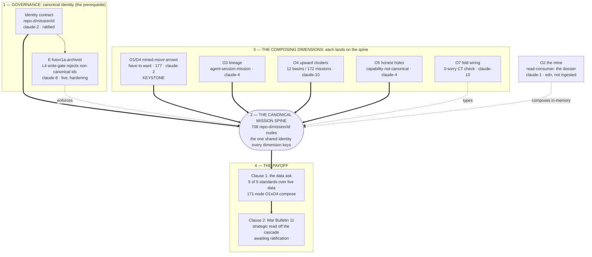
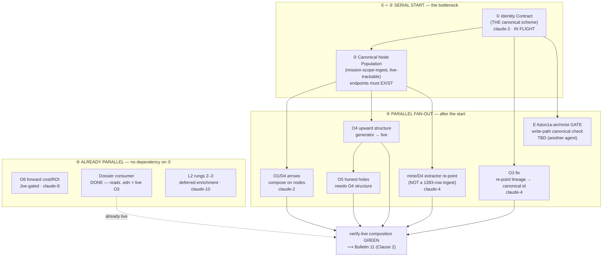

# C-cascade-real — RUN/DELIVER parallelism cascade (2026-06-30)

*Can RUN/DELIVER be parallelized, or is it linear? Answer: a **short serial start**
(2 steps), then a **wide parallel fan-out**. Three cars are **already parallel** with
no dependency on the start. Built while the identity contract is in flight.*

> **UPDATE (claude-2, 2026-06-30) — the serial start got SHORTER.** Canonical scheme resolved =
> `<repo>-d/mission/<id>` (708 nodes already exist). So step ② "Canonical Node Population" is
> **largely DONE** — the real ② is **RE-KEY** O3 + the mine to the canonical id (small), not
> populate. The bottleneck is now just: ① contract (ANSWERED) → O3-fix / mine-re-key, then the
> fan-out. D4's arrows already use canonical ids on the have-side.

## The cascade, as built (detailed)

This is the delivered architecture — what each portion *is* and how it relates to the work. The
abstract parallelism plan (below) was the route; this is the destination.

### Reading the diagram

**1 — Governance (the prerequisite, bottom).** Before *any* dimension could compose, the same
mission had to be **one node**. The whole campaign stalled here until claude-2 ratified the
canonical scheme `<repo>-d/mission/<id>` (708 nodes), and claude-8 built the **archivist** — an
L4 write-gate that rejects non-canonical ids so the drift (`mission:M-*`, `mission/M-*`) can't come
back. *This box is the load-bearing finding of the campaign: ambiguous identity is a
self-knowledge problem, not a hygiene one.*

**2 — The canonical mission spine (centre).** The 708 `<repo>-d/mission/<id>` nodes are the shared
identity. Composition *is* the fact that every dimension references **these same nodes** — that's
the difference between one cascade and seven pictures. O3 was re-keyed onto it; O1's 177 arrows
land 177/177 on it.

**3 — The composing dimensions (each `==>` the spine).** Five independent views, each landing on
the spine:
- **O1/D4 — mined-move arrows** (the keystone): the mined `have→want` moves the magnet feeds on;
  177 arrows, have-side on canonical missions. *This is the node O1×O4 first met on.*
- **O3 — lineage**: which agent/session is clocked on each mission — the durable "no sheet of
  paper" reconstitution (survives a teardown).
- **O4 — upward clusters**: the 12 high-level "basins" above individual missions (172 missions);
  the cascade's *upward* layer.
- **O5 — honest holes**: the real coverage gaps. Today the one genuine hole is
  `capability-layer-not-canonical` (capabilities still on the bare-alias scheme) — which points
  straight back at box 1 as the archivist's next target. *Honest holes are the point.*
- **O7 — fold wiring** (dotted `types`): the fold's CT wiring, machine-checked 0-sorry against the
  DarkTower Lean theory — certifies the *shape* is sound, not the semantics.
- *Evidence the `==>` arrows are real, not aspirational:* O1×O4 share **171** canonical mission
  nodes, O5×O1 share **176**, all `:consistent? true`.

**O2 — the mine (dotted, composes in-memory).** The mine is a **read-consumer**, not a resident:
the dossier composes the mine's `.edn` with live O3 in memory — value *without* a substrate write
(value-before-ingest). That's why its arrow is dotted: it joins the spine at query time, it isn't
written onto it.

**4 — The payoff (top).** The spine + dimensions = **Clause 1** (the data ask): the five CHARTER
standards, all met over live data (regenerates · resolves-to-evidence · reconstitutes · honest
holes · composed). **Clause 2** is **War Bulletin 11** — the strategic self-portrait read *off*
the now-composing cascade — awaiting Joe's ratification.

The arrows carry the campaign's thesis: **governance → one identity → the dimensions meet → the
data ask is met → the strategy is re-read.**

---

## Verdict

| | what | why |
|---|---|---|
| **Serial bottleneck (unavoidable)** | ① Identity Contract → ② Canonical Node Population | nothing can *compose* until each entity has one canonical id AND the endpoint nodes exist. Only ~2 of the active missions are nodes today; three id-schemes are live. This is the whole reason the mine "ingest" stalled. |
| **Parallel fan-out (after ①/②)** | O3-fix · archivist-gate · D4 arrows · O4 structure · mine/D4 extractor re-point · O5 holes | once identities unify and nodes exist, these are independent — different owners, no ordering between them (except O5 needs O4's structure). |
| **Already parallel (no dependency on ①)** | O6 forward-model · the **dossier** (DONE) · L2 rungs 2–3 | own data / own sources; can proceed now. |
| **Terminal (convergence)** | `verify-live` composition GREEN → **Bulletin 11** | needs ≥2 dimensions composing on canonical nodes. |

**So:** the *only* thing that must be linear to get started is **identity contract → node
population** (steps ①②). After that, ~6 cars fan out in parallel, and 3 more never needed the
serial start at all. "Some of it can be parallelized" → **most of it can**, behind a 2-step gate.

## The cascade

## Per-car table (depends-on · can-start-when · owner · group)

| car | depends on | can start | owner | group |
|---|---|---|---|---|
| ① Identity contract | — | **now (in flight)** | claude-2 | serial |
| ② Node population | ① | after ① | claude-2 / TBD | serial |
| O3 fix (re-point lineage) | ① (scheme only) | after ① | claude-4 | parallel |
| E-futon1a-archivist gate | ① | after ① | **TBD** | parallel |
| O1/D4 arrows | ② | after ② | claude-2 | parallel |
| O4 upward structure | ② | after ② | TBD | parallel |
| mine/D4 extractor re-point | ② | after ② | claude-4 | parallel |
| O5 honest holes | O4 | after O4 | TBD | parallel |
| O6 forward cost/ROI | — (Joe gate) | **now** | claude-8 | independent |
| Dossier consumer | — | **DONE** | claude-4 | independent |
| L2 rungs 2–3 | — | **now** | claude-10 | independent |
| Bulletin 11 | composition green | terminal | Joe + claude-4 | terminal |

## Notes
- The serial start is *short* but *hard* — it's the cascade-real keystone moved down to the
  identity layer (Clause 3). Skipping it is what produced the three-scheme mess.
- O3-fix needs only the **scheme** (①), not the full population (②) — it's the earliest parallel
  car claude-4 can take the moment claude-2 answers.
- The **dossier already delivers value** with zero dependency — it's the proof the campaign bought
  something before the substrate work lands.
- Critical-path length to "composition green" ≈ ① → ② → (D4 ∥ O4 ∥ O3-fix) → TERM — roughly
  **4 hops**, most of the width parallel.
