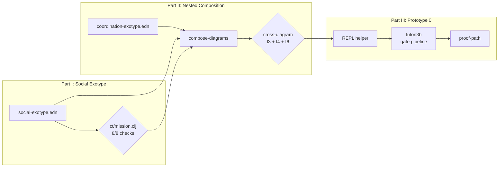

# Mission: Social Exotype

Write the abstract wiring diagram for the social coordination loop, extend
futon5's validation framework to support nested diagram composition, and
validate the three-diagram stack (futon3a + futon3b + futon3c) as one
coherent system.

This mission is the VERIFY step of the derivation xenotype:
IDENTIFY → MAP → DERIVE → ARGUE → **VERIFY** → INSTANTIATE.

IDENTIFY through ARGUE are complete: `library/social/ARGUMENT.flexiarg` composes
three evidence-grounded social patterns into a formal case for futon3c with
seven tensions (S1-S7), ten requirements (R1-R10), five theory demands (T1-T5),
six convergence points (C1-C6), a thesis, and three pending verification
criteria (V1-V3). This mission satisfies V1 and V2; V3 (round-trip proof)
requires implementation and belongs to a subsequent mission.

## Owner

Claude (+ Codex for futon5 composition extension).

## Reviewer

Codex reviews the social exotype diagram (Part I).
Claude reviews the composition framework (Part II).
Cross-validation: the three-diagram composition must pass machine checks.

## Scope

### Scope In

- Write `social-exotype.edn`: abstract wiring diagram for the social timescale,
  encoding the agency reading of each gate (ARGUMENT C6)
- Validate standalone: `ct/mission.clj` 8/8 checks pass on the social exotype
- Extend `ct/mission.clj` to validate parallel/nested diagram composition
  (currently only serial composition via `compose-missions` is supported)
- Write three-diagram composition test: futon3a + futon3b + futon3c validated
  together with cross-diagram I3, I4, I6 checks
- Build thin REPL helper (Prototype 0) for submitting futon3c development tasks
  through the futon3b gate pipeline — the bootstrap closure from M-f6-recursive

### Scope Out

- Implementing Agency, Forum, Drawbridge, peripheral code (subsequent missions)
- Full pheno-geno-exo-xeno coverage (xeno = self-description, save for later)
- Rewriting futon5's existing validation framework (extend, not rewrite)
- futon3a diagram (it is infrastructure, not a loop; include as a shared
  constraint surface, not as a separate AIF diagram)
- Production HTTP endpoint for the REPL helper (REPL-first; HTTP is a
  subsequent concern)

## Time Box

2 weeks. Part I (the exotype) should take < 1 week; Part II (composition) is
the novel theoretical contribution and may need iteration.

## Exit Conditions

- Part I satisfied: social-exotype.edn passes 8/8 checks standalone
- Part II satisfied: three-diagram composition passes cross-diagram checks OR
  the attempt has identified a specific structural limitation in the composition
  framework (either outcome is valuable)
- Part III satisfied: at least one futon3c development task submitted through
  gates, producing a durable proof-path
- **Explicit exit**: if the social→task boundary is inexpressible in the current
  edn format, record the blocker, park the mission with `:blocked` status and
  reference to what needs to change in futon5

## Prerequisites

- [x] Social ARGUMENT complete (`library/social/ARGUMENT.flexiarg`)
- [x] Three social patterns written (`library/social/*.flexiarg`)
- [x] Coordination exotype validated (8/8 checks)
- [x] futon3b Part III complete (L1 glacial loop operational, 31 tests)
- [x] Devmap updated for three-futon split
- [ ] futon3a diagram exists (or is written as part of this mission)

## Interface Signature

### Mission Diagram



### What the Social Exotype Must Encode

From the ARGUMENT's convergence analysis (C2, C5, C6):

**Social-timescale components** (the agency reading of each gate):

| Component | Agency Reading (C6) | Gate Dual |
|-----------|-------------------|-----------|
| Dispatcher | Is the agent's task well-defined? | G5 |
| Authenticator | Can this agent do this work? | G4 |
| Session tracker | Has the agent committed to an approach? | G3 |
| Peripheral manager | Agent stays within budget | G2 |
| Handoff coordinator | Agent's work gets evaluated | G1 |
| Continuity store | Agent's session is recoverable | G0 |

**Social-timescale requirement layers** (C2):

| Layer | Requirements | Boundary |
|-------|-------------|----------|
| Transport | R1 (delivery), R7 (readiness), R8 (transcript), R9 (structure) | social → social |
| Routing | R2 (authority), R5 (lifecycle), R6 (identity), R10 (mode) | social → task |
| State | R3 (atomicity), R4 (errors) | task → task (already in futon3b) |

**Three-timescale loop** (C5):

```
social (seconds) → task (minutes) → glacial (weeks)
    ↑                                     |
    └─────── library constrains ──────────┘
```

### Shared Constraint Surface

`I-patterns` and `I-registry` are shared across all three diagrams. The
composition framework must validate that:
- Each diagram treats them with the correct timescale
- No diagram writes to them at a faster timescale than allowed
- The I4 (exogeneity) check holds across the composition, not just within
  each diagram

## Argument (Pattern-Backed)

The full argument is in `library/social/ARGUMENT.flexiarg`. The thesis:

> futon3c must break the build-confess-rebuild cycle by: (1) deriving invariants
> from futon-theory before writing code, (2) emitting typed events into the
> shared proof-path store, (3) building as bounded missions with explicit
> lifecycle transitions, and (4) treating agency/realtime patterns as evidence
> of tensions, not as the architectural specification. The social loop is the
> agency SIDE of the gate pipeline — the half that was specified in the duality
> table but never implemented.

This mission IS thesis point (1): deriving the invariants before writing code.
The exotype diagram makes the invariants machine-checkable. The composition
framework makes the cross-timescale invariants checkable.

### Mana and Theoretical Readiness

The futon5 missions were gated awaiting "mana." The deeper blocker was
theoretical readiness — the ability to validate multi-timescale compositions.
This mission earns that readiness:

| What this mission produces | Mana type | What it unblocks |
|---------------------------|-----------|------------------|
| social-exotype.edn passes 8/8 | `:evidence-validated` | futon3c implementation missions |
| Composition framework works | `:proposal-accepted` | Gated futon5 missions (pheno-geno-exo) |
| Three-diagram validation | `:pattern-complete` | Self-describing stack (future xeno layer) |

The fast-social-glacial stacking validated here is isomorphic to pheno-geno-exo
stacking in futon5. Solving one solves both — not by analogy but by structural
identity (same composition rules, same invariant checks, same timescale ordering).

## Design

### Why Verification Before Implementation

The three social patterns document a cycle:

```
build without tests → discover violations → confess invariants → rebuild
```

The ARGUMENT (C4) requires breaking this cycle by verifying before composing.
The coordination rewrite (futon3b) followed this: exotype diagram BEFORE gate
code. The social loop must do the same.

The derivation xenotype positions VERIFY between ARGUE and INSTANTIATE. This
mission IS the VERIFY step — checking that the argument's structure is
categorically sound before writing any social-loop code.

### What Nested Composition Requires

Currently `ct/mission.clj` has `compose-missions` for serial composition (A→B).
The three-futon stack is not serial — it's a shared-constraint parallel
composition with asymmetric feedback:

```
futon3c (social)  ──→  futon3b L0 (task)  ──→  futon3b L1 (glacial)
    ↑                       ↑                        │
    │    shared: I-patterns, I-registry               │
    └─────────── library constrains ──────────────────┘
```

The composition must check:
1. **Cross-diagram I3** (timescale ordering): social edges must not skip the
   task timescale to reach glacial. Social→glacial requires going through task.
2. **Cross-diagram I4** (exogeneity): no social output reaches glacial
   constraints directly. The L1-canon→I-patterns path is the ONLY legitimate
   constraint-modification path, and it's glacial→glacial.
3. **Cross-diagram I6** (compositional closure): the composed system has a
   default mode that sustains it when any one timescale stalls.
4. **Shared port consistency**: I-patterns in diagram A is the same I-patterns
   in diagram B — same type, same timescale, same constraint flag.

### Prototype 0: Gate-Governed Build

A thin REPL helper that formats a futon3c development task as a valid gate
pipeline input and submits it. This is the bootstrap closure from
M-f6-recursive: "The pipeline that analyses the futon codebase was itself
built by the pipeline it analyses."

Minimum viable:
```clojure
;; Submit "write social-exotype.edn" as a task through futon3b gates
(require '[futon3.gate.pipeline :as pipeline])
(pipeline/run
  {:I-request   {:task/id "social-exo-001"
                 :task/mission-ref "M-social-exotype"
                 :task/intent "Write the social-timescale abstract wiring diagram"
                 :task/scope {:in ["social-exotype.edn"] :out ["implementation code"]}
                 :task/success-criteria ["8/8 ct/mission.clj checks pass"]}
   :I-missions  (relations/load-missions)
   :I-patterns  {:library-roots ["library/"]}
   :I-registry  {:agents {"claude" {:capabilities #{:diagram :clojure :review}}}}
   :opts        {:store-dir "/tmp/social-exotype-proof-paths"}})
```

The proof-path produced by this submission IS evidence that the bootstrap
closure works: a futon3c task governed by futon3b infrastructure.

## Parts

### Part I: Social Exotype (V1)

Write `social-exotype.edn` in the same format as `coordination-exotype.edn`.

| Step | What | Artifact |
|------|------|----------|
| 1.1 | Draft social-timescale ports from ARGUMENT R1-R10 | Port definitions |
| 1.2 | Draft social-timescale components from ARGUMENT C6 duality | Component definitions |
| 1.3 | Draft edges: social→social and social→task boundaries | Edge definitions |
| 1.4 | Validate standalone: `ct/mission.clj` 8/8 checks | Validation output |
| 1.5 | Codex review | Review comments |

**Part I gate**: social-exotype.edn passes all 8 checks. Do not proceed to
Part II until satisfied.

### Part II: Nested Composition (V2 + futon5 contribution)

Extend `ct/mission.clj` to validate multi-diagram composition.

| Step | What | Artifact |
|------|------|----------|
| 2.1 | Define `compose-parallel` function signature | API design |
| 2.2 | Implement shared-port consistency check | New check function |
| 2.3 | Implement cross-diagram I3 (timescale ordering) | Extended I3 check |
| 2.4 | Implement cross-diagram I4 (exogeneity) | Extended I4 check |
| 2.5 | Implement cross-diagram I6 (compositional closure) | Extended I6 check |
| 2.6 | Write three-diagram composition test | Test file |
| 2.7 | Validate: coordination + social exotypes compose cleanly | Validation output |

**Part II gate**: the three-diagram composition passes all cross-diagram checks
OR a specific structural limitation is documented with a `:blocked` transition.

### Part III: Gate-Governed Build (Prototype 0)

The REPL helper that submits futon3c tasks through futon3b gates.

| Step | What | Artifact |
|------|------|----------|
| 3.1 | Register M-social-exotype in futon3b's missions.edn | Mission entry |
| 3.2 | Write thin REPL helper namespace | `futon3c.bootstrap` or similar |
| 3.3 | Submit first task, capture proof-path | Proof-path EDN |
| 3.4 | Verify proof-path contains all gate evidence (PSR, PUR, PAR) | Manual check |

**Part III gate**: at least one proof-path exists showing a futon3c development
task validated through futon3b gates.

## Success Criteria

### Part I (Social Exotype)
- [x] social-exotype.edn written with ports, components, edges
- [x] Standalone validation: 8/8 ct/mission.clj checks pass
- [x] All ARGUMENT requirements (R1-R10) traceable to diagram elements
- [ ] Reviewer sign-off

### Part II (Nested Composition)
- [x] `compose-parallel` (or equivalent) implemented in ct/mission.clj
- [x] Cross-diagram I3 check implemented and passes
- [x] Cross-diagram I4 check implemented and passes
- [x] Cross-diagram I6 check implemented and passes
- [x] Shared-port consistency validated (I-patterns same across diagrams)
- [x] Three-diagram composition test passes (6 tests, 12 assertions)
- Composed: 5 inputs, 7 outputs, 16 components, 69 edges, 8/8 checks
- Merged to futon5 main (d5ae681, 2026-02-10)

### Part III (Prototype 0)
- [x] M-social-exotype registered in futon3b mission store
- [x] REPL helper submits a task and receives proof-path
- [x] Proof-path contains typed PSR, PUR, PAR records

### Derivation Requirements
- [ ] Every diagram component cites its ARGUMENT requirement (R1-R10)
- [ ] Every cross-diagram check cites its Chapter 0 invariant (I1-I6)
- [ ] Trace: ARGUMENT → exotype port/component → ct/mission check → validation output

## Failure Modes

| Failure | What It Means | Response |
|---------|---------------|----------|
| Social exotype fails I3 | Social→glacial edge without task intermediary | Fix the edge: social must go through task |
| Social exotype fails I4 | Social output reaches I-patterns directly | Remove the edge: only L1-canon writes to I-patterns |
| Composition framework inexpressible | Shared constraints need a richer model than current edn | Document the gap; this IS a valuable futon5 finding |
| Gate pipeline rejects futon3c task | Mission not registered or task shape wrong | Fix registration; the rejection is the pipeline working correctly |
| Cross-diagram I6 fails | No composed default mode | Design a cross-timescale default mode; this is genuinely hard |

## Connects To

- **Depends on**: social ARGUMENT (complete), futon3b L0+L1 (complete),
  ct/mission.clj (to be extended)
- **Feeds**: futon3c implementation missions (M-agency-refactor, M-forum-refactor,
  M-peripheral-model — these cannot be scoped until the exotype exists)
- **futon5 contribution**: nested composition validation — same framework
  validates pheno-geno-exo stacking
- **M-f6-recursive**: the Prototype 0 REPL helper is a preview of bootstrap
  closure ("the pipeline governs its own construction")
- **Mana**: this mission earns the theoretical readiness that unblocks
  gated futon5 missions

## Specification Reference

- **Social argument**: `futon3/library/social/ARGUMENT.flexiarg`
- **Social patterns**: `futon3/library/social/*.flexiarg` (3 patterns)
- **Coordination exotype**: `futon5/data/missions/coordination-exotype.edn`
- **Concrete diagram**: `futon5/data/missions/futon3-coordination.edn`
- **Validator**: `futon5/src/futon5/ct/mission.clj`
- **AIF specification**: `futon5/docs/chapter0-aif-as-wiring-diagram.md`
- **War room**: `futon3/holes/war-room.md`
- **Duality table**: `futon3/library/coordination/INDEX.md` §Dual Interpretation
- **Mana protocol**: `futon5/docs/nonstarter-terminal-vocabulary.md` §Mana
- **Sospeso protocol**: `futon5/AGENTS.md` §Sospeso Protocol

## Derivation Provenance

| Step | What Was Done | Artifact |
|------|---------------|----------|
| IDENTIFY | Audited futon3 git log for social-layer failures | Git archaeology (session transcript) |
| MAP | Mapped failures to futon-theory patterns | Three social patterns |
| DERIVE | Derived 10 requirements from agency/realtime patterns via futon-theory | ARGUMENT R1-R10 |
| ARGUE | Composed argument with tensions, requirements, theory, convergence | `library/social/ARGUMENT.flexiarg` |
| **VERIFY** | **This mission** — exotype diagram + nested composition | `social-exotype.edn` + composition tests |
| INSTANTIATE | Subsequent missions (M-agency-refactor, etc.) | Future |

## Outpost O-0: Can We Draw the Diagram?

Before extending ct/mission.clj (Part II), hand-write social-exotype.edn and
validate it standalone. This tests whether the social loop's structure is
expressible in the current diagram format.

**Data**: ARGUMENT C2 (requirement layers), C6 (duality table), coordination-exotype.edn (format reference)

**Validates**:
- [ ] Social-timescale components expressible in existing edn format
- [ ] Social→task boundary encodeable as typed edges
- [ ] I3 and I4 hold for social timescale alone (no cross-diagram needed yet)

**Depends on**: ARGUMENT (complete), coordination-exotype (complete)
**Feeds**: Part II (composition needs a valid standalone diagram first)
