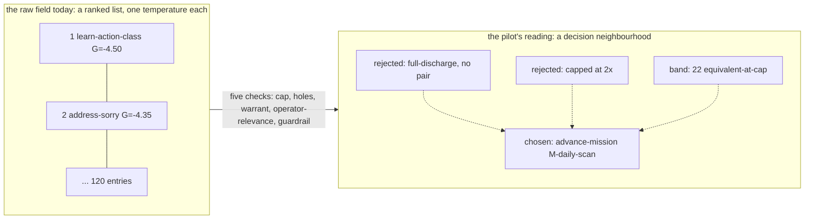
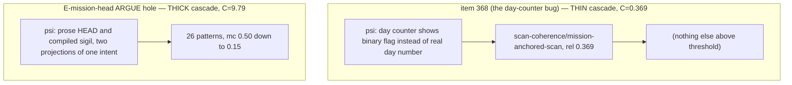
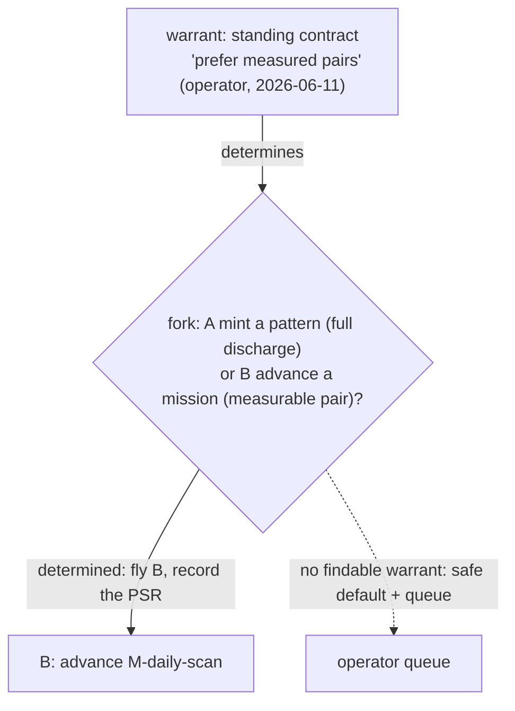

# A day in the life of a War Machine pilot — the VERIFY narrative

Part of M-first-flights' VERIFY phase. The design under test is
flight-as-derivation (register R0–R10). The test is you: if this story and
its mockups read sensibly — if at every beat you can tell what the pilot
knew, did, and proved — the shape is right. Where the mockups show values
the current records actually contain, they are verbatim (from flight
`live-0d6e0acd…`, your panel's example). Where they show values only the
NEW shape would record, they are marked `~` for illustrative — those are
exactly the things we currently throw away, so no record of them exists to
quote.

## Morning: the field

The pilot opens the field. Two hundred-odd actions, ranked. Today's panel
says only:

    field-read    present    120 ranked actions

In the new shape, the first thing the pilot — or you, re-reading later —
sees is not the count but the decision:

    field-read    120 ranked actions · decision neighbourhood: 3 weighed
      chosen    advance-mission M-daily-scan     G -4.1233 · Gc -4.0836 · holes 5 · rule clear
      rejected  address-sorry pattern-measure-never-target   ~ full-discharge: no measurable pair
      rejected  advance-mission M-chipwitz-corps              ~ capped (12 holes ≥ 6)
      band      ~ 22 missions tie at the 2× cap — equivalent under the current model
      warrant   operator-directed (cycle 9) + standing contract: below-cap counted hole

    [RET on any row descends; RET on the band shows the raw ranked list]

The chosen row is verbatim from today's record. The rejected rows and the
band are illustrative — the pilot weighed them this morning and the record
kept no trace. That weighing is requirement R4 and R7: the neighbourhood
and the warrant.

## Midday: trusting the target

Before flying, the pilot checks the target: grep the mission doc for open
boxes, read each one, classify it. Today that work vanishes. In the new
shape it is the verification block:

    verification   M-daily-scan: 5 holes found
      item 368   ~ bounded-doable — "brief Day counter shows 1 / 2+" (display bug)
      item 367   ~ operator-gated — scan-intent is Joe's call
      others     ~ standing-tasks (3)
      ⇒ chosen hole: item 368

Requirement R9. One glance now answers what the stock-take had to
reconstruct from prose: why this hole and not its neighbours.

## The act

The pilot fixes the counter, commits, and captures the witness. Today's
record holds one string. The new shape holds the witness with its ground:

    act        executed
      witness  futon7 701522d
      ground   ~ verified-by: pilot · kondo 0/0 · ns loads

Requirement R8. For a codex build this block answers "did anyone re-run
the gates before trusting the sha?" — the question the three-way review
exists to make answerable.

## The wait: settling

This is the richest work the pilot does and the record's biggest silence.
The pilot computes a threshold (commit time plus one scan duration —
because a scan that *finishes* after the commit may have *started* before
it), forces a scan, and polls until two distinct scans agree. Today all of
that compresses to one word, `settled`. In the new shape:

    measurement   discharge  -4.1233 → -4.0847 · error 0.0386 · class: clean-dynamics
      window      ~ begin 12:01:42 · commit 12:08:15 · threshold 12:09:40
      settle      ~ scan 12:14:09 G -4.0846 · scan 12:21:33 G -4.0847 · |ΔG| 0.0001 ≤ ε 0.005
      counterfactual  constant predicted -4.0836 → its error 0.0397 (state-blind: predicts no move)
      verdict     clean-dynamics: the hole-closure moved settled G by the per-hole increment

Requirements R1 and R3. Note what the verdict line buys: this flight's
error 0.0386 and a censored fallback's error 0.0000 are no longer two bare
numbers — one says clean-dynamics with a two-scan witness, the other would
say fallback: target vanished, realised copied, with no witness possible.
The 0.0000 ambiguity that cost the stock-take an afternoon dies here.

## Evening: the out-of-band

Joe merged the close; the discipline channel recorded it (verbatim, this
exists today):

    out-of-band   operator-merge @ 12:29:19Z

And the flight takes its place in the graph rather than the tape:

    links   ~ applies-lesson-of: T8 (pilot-closeable-hole check)
            ~ re-measured-by: T10 (the 4→3 transition confirming the increment)

Requirement R10. Re-reading this flight a month from now, you can walk to
the flight that taught it and the flight that confirmed it.

## The other kind of day: a refusal

Not every day ends in a merge. The Turn-2 day ended in the pilot refusing
the field's top recommendation — and today that flight has no record at
all. In the new shape a refusal is a complete flight:

    act        refused
      finding  ~ target already closed → recommendation is an un-earnable teleport
    measurement   not-applicable (refused-before-act)
    out-of-band   teleport-refused @ 19:42 (verbatim — this event exists today)

Requirement R2. The most valuable flight of the first twenty becomes
readable instead of being a gap in the tape.

## What you are verifying

1. Does each beat's mockup tell you what happened without prose
   archaeology?
2. Is the verbatim/illustrative split honest — is anything marked `~`
   something you believe the apparatus already records? (If so, the map is
   wrong.)
3. Is anything you'd want on a re-read still missing? (That is a new R.)

## Build order, if the story verifies

Piece by piece, each rolled out and then stepped through live by claude-3
so the realised model is checked against the seat that specified it:

1. The schema (EDN, exit-1) and the logic model (exit-2 — the stale-begin
   confound as the canonical adversarial record).
2. close-live-cycle! persists the grounds it already computes (window,
   verification, warrant) — recording change only, no behavior change.
3. The projector reads grounds instead of adjudicating; flight-mode grows
   RET-descend (the render lane; bellable).
4. Backfill pass: the twenty Orville records re-emitted derivation-thin
   with honest flags.
5. The substrate-2 round-trip (exit-4), then your side-by-side session
   (exit-5).

## The data shapes (diagrams for the verify-read)

Joe's question on the Morning beat: is the field a list, a graph, an
activation pattern, a cascade? The honest answer is that today it is a flat
ranked list — one temperature per action — and the pilot's reading
*manufactures* everything else in context. The shapes below show what the
record should carry so the manufacturing survives.

### Shape 1 — the raw field versus the pilot's reading

The temperature-gauge worry is exactly right: the list alone is a gauge.
The neighbourhood is what the pilot actually constructs from it, and R4
says the record keeps the neighbourhood, not just the gauge reading.

### Shape 2 — a candidate as a pattern cascade (real data, both extremes)

Each candidate can be put to the library as a circumstance: "how would the
pattern language address this hole?" The scan's cascade lane already
computes this. The answer's *thickness* is information the pilot uses:

Both cascades are real runs (the thin one from this mission's own anatomy
workup; the thick one from early-closures Closure 01 territory). The
reading: a thin cascade says "the library has little here — the fold will
be plain code"; a thick one says "this hole lives in pattern territory."
That is a different instrument from the temperature gauge, and the pilot
wants both. VERIFY finding for the register: the neighbourhood's
candidates may carry their cascade (psi, patterns, C) — and when the
warrant is pattern-grade, it is typically a member of that cascade, which
is the ChipWitz warrant-finder appearing inside the record shape.

### Shape 3 — the choice point, with the warrant as the resolving arrow

This is the A-or-B shape the pilot actually faces, and the warrant is what
makes it a determined fork rather than an ask. R7 records the fork, the
warrant, and which way it resolved; the cycle-5 dispute ("was that
escalation correct?") is unanswerable today precisely because this shape
is in no record.

### What this adds to the register

V-f1 (VERIFY finding, feeds back into R4/R7): the field-read's typed home
has three layers, not one — the gauge (the ranked list, linked), the
neighbourhood (the candidates weighed, with reject-reasons), and per
candidate an optional cascade (psi, patterns, C) from which a
pattern-grade warrant is drawn when one exists. Choice points are
first-class: a fork with its warrant and resolution, or its queue-entry
when undetermined.
